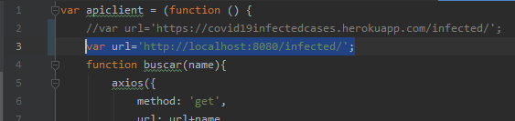
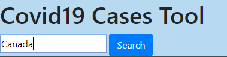
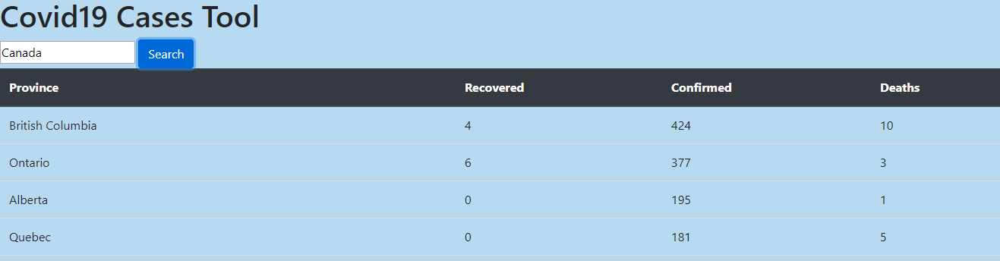
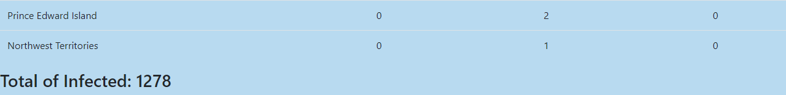
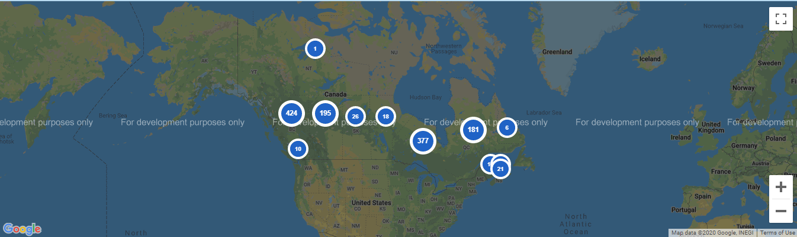
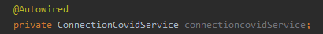

# Covid19 Cases
Aplicación web de obtención de casos de covid19 en el mundo

Desarrollador: Daniel Felipe Walteros Trujillo

Link de la aplicación: [http://localhost:8080/](http://localhost:8080/)

## Requisitos para Ejecución de forma local

- Maven
- Java Versión 8

## Instrucciones de Ejecución Local

1) Cambiar la variable de url en apiclient por `http://localhost:8080/infected`

    

2) Ubicarse en la carpeta `Covid19Cases` y desde el cmd de windows utilizar loa siguientes comandos:
 
3) Para compilar `mvn package`

4) Para ejecutar las pruebas `mvn test`

5) Para ejecutar la aplicacion `mvn spring-boot:run` y dirigirse a la direccion [http://localhost:8080/](http://localhost:8080/) en cualquier web browser

## Intrucciones de Uso

1) En el buscador ingresar el pais del cual se quieren conocer los casos de covid 19 y presionar el boton "Search"

2) La tabla cargará por provincia los cantidad de personas recuperadas, confirmadas y muertas por covid19; en caso de que el pais sea de geografía pequeña se cargara un resumen general de todo el país.

3) Debajo de la tabla se cargará el número total de casos confirmados del país.

4) Al final se encuentra un mapa con la ubicación de las providencias o del país mostrando la cantidad de perssonas confirmadas en la misma, el zoom del mapa a veces se carga de fora excesiva, por lo cual a veces se tiene que persionar el boton - del mapa varias veces para poder visualizarlo.

## Realizar Cambios de Dependencias

### Realizar cambios en la obtención de los datos del covid19

En la clase de servicios, se obtienen los datos por medio de una interfaz inyectada con spring boot

Por esta razón, para cambiar la forma en la que se obtienen los datos del covid19 se puede realizar de dos formas:

- Implementando un clase que implemente la interfaz ConnectionCovidService si se van a tomar de otra forma.
- Alterando los atributos url, host y key en la clase HTTPConnectionCovidService si van a tomarse de la misma forma, pero de otro recurso.

### Realizar cambios en la obtención de coordenadas

En la clase de servicios, se obtienen las coordenadas por medio de una interfaz inyectada con spring boot

Por esta razón, para cambiar la forma en la que se obtienen las coordenadas se puede realizar de dos formas:

- Implementando un clase que implemente la interfaz ConnectionCoordinatesService si se van a tomar de otra forma.
- Alterando los atributos url y key en la clase HTTPConnectionCovidService si van a tomarse de la misma forma, pero de otro recurso.

### Realizar cambios en la implementación de los servicios

La clase de servicios es utilizada por el controlador por medio de una interfaz inyectada con spring boot

Por esta razón, para cambiar la forma en la que la capa se servicios funciona se puede implementar un clase que implemente la interfaz Covid19Services.

### Realizar cambios en la implementación del caché

En la clase de servicios, se implementa el caché por medio de una interfaz inyectada con spring boot

Por esta razón, para cambiar la forma en la que los datos se guardan en caché se puede implementar un clase que implemente la interfaz ConnectionCoordinatesService.

### Realizar cambios en la implementación de la página web

Para realizar otro javascript que implemente esta aplicación, basta con cambiar el atributo apiclient del app.js ubicado en src/main/resources/static/js por el nombre del modulo desarrollado.

